# AR Furniture Platform - System Architecture with Category Filtering

## Complete System Architecture Diagram

```mermaid
graph TB
    subgraph "Database Layer"
        MODELS[("📦 MODELS TABLE<br/>━━━━━━━━━━━━━━━<br/>• id (unique)<br/>• title<br/>• customer_id<br/>• customer_name<br/>• sku<br/>• aws_url (3D file)<br/>• category_slug (auto)<br/>• product_category (NEW)<br/>• product_subcategory (NEW)<br/>• dimensions<br/>• metadata")]

        VARIANTS[("🎨 MODEL_VARIANTS TABLE<br/>━━━━━━━━━━━━━━━<br/>• id (unique)<br/>• parent_model_id ➜<br/>• variant_name<br/>• hex_color<br/>• sku<br/>• aws_url (3D file)<br/>• dimensions_text<br/>• is_primary")]

        CUSTOMERS[("👥 CUSTOMERS/USERS<br/>━━━━━━━━━━━━━━━<br/>• customer_id<br/>• customer_name<br/>• role<br/>• credentials")]

        MODELS ---|"1 to Many"| VARIANTS
        CUSTOMERS ---|"1 to Many"| MODELS
    end

    subgraph "Upload & Management Flow"
        UPLOAD["📤 UPLOAD FORM<br/>━━━━━━━━━━━━━━━<br/>1. Select 3D File (.glb)<br/>2. Enter Title & Description<br/>3. SELECT CATEGORY (NEW)<br/>4. Enter SKU (optional)<br/>5. Set Customer<br/>6. Upload to AWS S3"]

        POSTMGMT["⚙️ POST-UPLOAD MANAGEMENT<br/>━━━━━━━━━━━━━━━<br/>• Edit Product Details<br/>• CHANGE CATEGORY (NEW)<br/>• Add/Remove Variants<br/>• Update SKU<br/>• Reassign Customer"]

        UPLOAD -->|Creates| MODELS
        POSTMGMT -->|Updates| MODELS
    end

    subgraph "Filtering System (Enhanced)"
        FILTERS["🔍 FILTER CONTROLS<br/>━━━━━━━━━━━━━━━"]

        CUSTFILTER["👤 Customer Filter<br/>(Existing)<br/>• All Customers<br/>• Specific Customer<br/>• Unassigned"]

        CATFILTER["📁 Category Filter<br/>(NEW)<br/>• All Categories<br/>• Couches<br/>• Chairs<br/>• Tables<br/>• Outdoor<br/>• Storage<br/>• Beds<br/>• Decor"]

        SEARCHFILTER["🔎 Search Filter<br/>(Existing)<br/>• By Title<br/>• By SKU<br/>• By Description"]

        FILTERS --> CUSTFILTER
        FILTERS --> CATFILTER
        FILTERS --> SEARCHFILTER
    end

    subgraph "Product Display"
        PRODUCTGRID["📱 PRODUCT GRID VIEW<br/>━━━━━━━━━━━━━━━<br/>Shows filtered products<br/>with all their variants"]

        PRODUCTCARD["🃏 PRODUCT CARD<br/>━━━━━━━━━━━━━━━<br/>• Main Product Info<br/>• Category Badge (NEW)<br/>• Quick Category Edit (NEW)<br/>• Variant Switcher<br/>• 3D Preview<br/>• Actions Menu"]
    end

    subgraph "Category Management Features (NEW)"
        CATUPLOAD["🏷️ Upload-Time Category<br/>━━━━━━━━━━━━━━━<br/>• Optional dropdown<br/>• Auto-detect from title<br/>• Save to product_category"]

        CATBULK["📦 Bulk Category Update<br/>━━━━━━━━━━━━━━━<br/>• Select multiple products<br/>• Assign category<br/>• Update all at once"]

        CATQUICK["⚡ Quick Edit Category<br/>━━━━━━━━━━━━━━━<br/>• Per product card<br/>• Dropdown selector<br/>• Instant update"]
    end

    %% Connections
    CUSTFILTER -->|Filters| PRODUCTGRID
    CATFILTER -->|Filters| PRODUCTGRID
    SEARCHFILTER -->|Filters| PRODUCTGRID

    PRODUCTGRID --> PRODUCTCARD

    CATUPLOAD --> MODELS
    CATBULK --> MODELS
    CATQUICK --> MODELS

    style MODELS fill:#2d3748,stroke:#4a5568,stroke-width:2px,color:#fff
    style VARIANTS fill:#2d3748,stroke:#4a5568,stroke-width:2px,color:#fff
    style CUSTOMERS fill:#2d3748,stroke:#4a5568,stroke-width:2px,color:#fff
    style CATFILTER fill:#065f46,stroke:#10b981,stroke-width:3px,color:#fff
    style CATUPLOAD fill:#065f46,stroke:#10b981,stroke-width:2px,color:#fff
    style CATBULK fill:#065f46,stroke:#10b981,stroke-width:2px,color:#fff
    style CATQUICK fill:#065f46,stroke:#10b981,stroke-width:2px,color:#fff
```

## Data Flow with Category Filtering

```mermaid
sequenceDiagram
    participant U as User
    participant UI as Admin UI
    participant API as API Server
    participant DB as Database
    participant S3 as AWS S3

    rect rgb(200, 255, 200)
        Note over U,S3: UPLOAD WITH CATEGORY (NEW)
        U->>UI: Upload 3D Model
        UI->>UI: Select Category (NEW)
        UI->>API: POST /api/upload-simple<br/>+ category field
        API->>S3: Store 3D file
        API->>DB: Save model with<br/>product_category
        DB-->>API: Model created
        API-->>UI: Success + Model ID
    end

    rect rgb(255, 230, 200)
        Note over U,DB: FILTERING WITH CATEGORIES (NEW)
        U->>UI: Select Filters:<br/>• Customer: "IKEA"<br/>• Category: "Chairs"
        UI->>API: GET /api/models<br/>?customer=ikea&category=chairs
        API->>DB: SELECT * FROM models<br/>WHERE customer_id='ikea'<br/>AND product_category='chairs'
        DB-->>API: Filtered models
        API->>DB: Get variants for each model
        DB-->>API: All variants
        API-->>UI: Models + Variants
        UI-->>U: Display filtered grid
    end

    rect rgb(200, 230, 255)
        Note over U,DB: POST-UPLOAD CATEGORY EDIT (NEW)
        U->>UI: Click "Edit Category"<br/>on product card
        UI->>UI: Show category dropdown
        U->>UI: Select new category
        UI->>API: POST /api/models/update-category
        API->>DB: UPDATE models<br/>SET product_category = 'outdoor'<br/>WHERE id = 'model123'
        DB-->>API: Updated
        API-->>UI: Success
        UI-->>U: Update card display
    end
```

## Category Hierarchy Structure

## Filter Combination Logic

## Implementation Priority

```mermaid
graph TD
    P1[Phase 1: Database Setup<br/>Add product_category column<br/>⏱️ 1 hour]
    P2[Phase 2: Upload Form<br/>Add category dropdown<br/>⏱️ 2 hours]
    P3[Phase 3: Filter UI<br/>Add category filter to dashboard<br/>⏱️ 2 hours]
    P4[Phase 4: Quick Edit<br/>Per-card category editing<br/>⏱️ 3 hours]
    P5[Phase 5: Bulk Operations<br/>Multi-select category update<br/>⏱️ 4 hours]
    P6[Phase 6: Migration<br/>Categorize existing products<br/>⏱️ 2 hours]

    P1 --> P2
    P2 --> P3
    P3 --> P4
    P4 --> P5
    P5 --> P6

    style P1 fill:#065f46,stroke:#10b981,stroke-width:2px,color:#fff
    style P2 fill:#065f46,stroke:#10b981,stroke-width:2px,color:#fff
    style P3 fill:#065f46,stroke:#10b981,stroke-width:2px,color:#fff
```

## Key Points Visualized

- **🔵 Blue/Teal Elements**: New category features
- **⚫ Dark Elements**: Existing system components
- **🟠 Orange Elements**: Critical combination logic
- **Solid Arrows**: Data flow
- **Dashed Lines**: Relationships

The category filtering operates at the **PRODUCT LEVEL** only, meaning when you filter by "Chairs", you get all chair products with ALL their color/size variants intact. This maintains the product-variant hierarchy while providing powerful filtering capabilities.